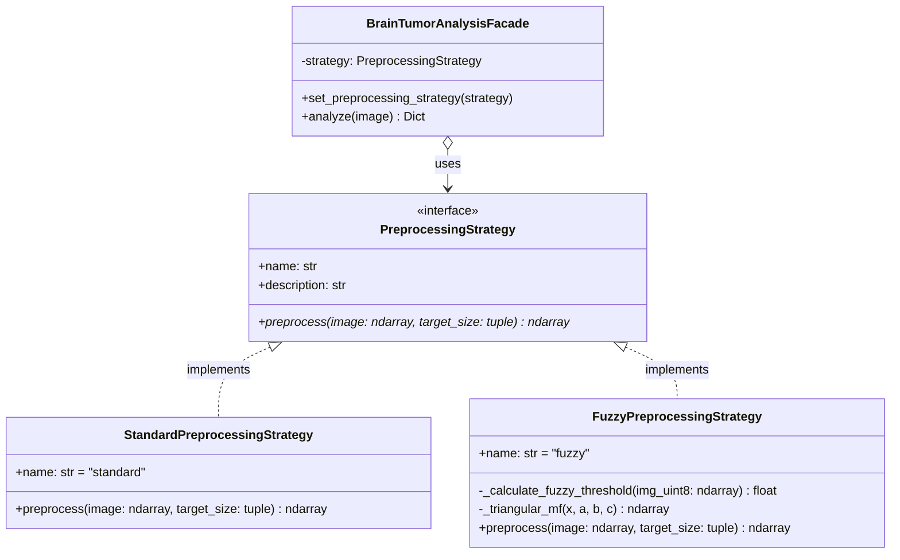
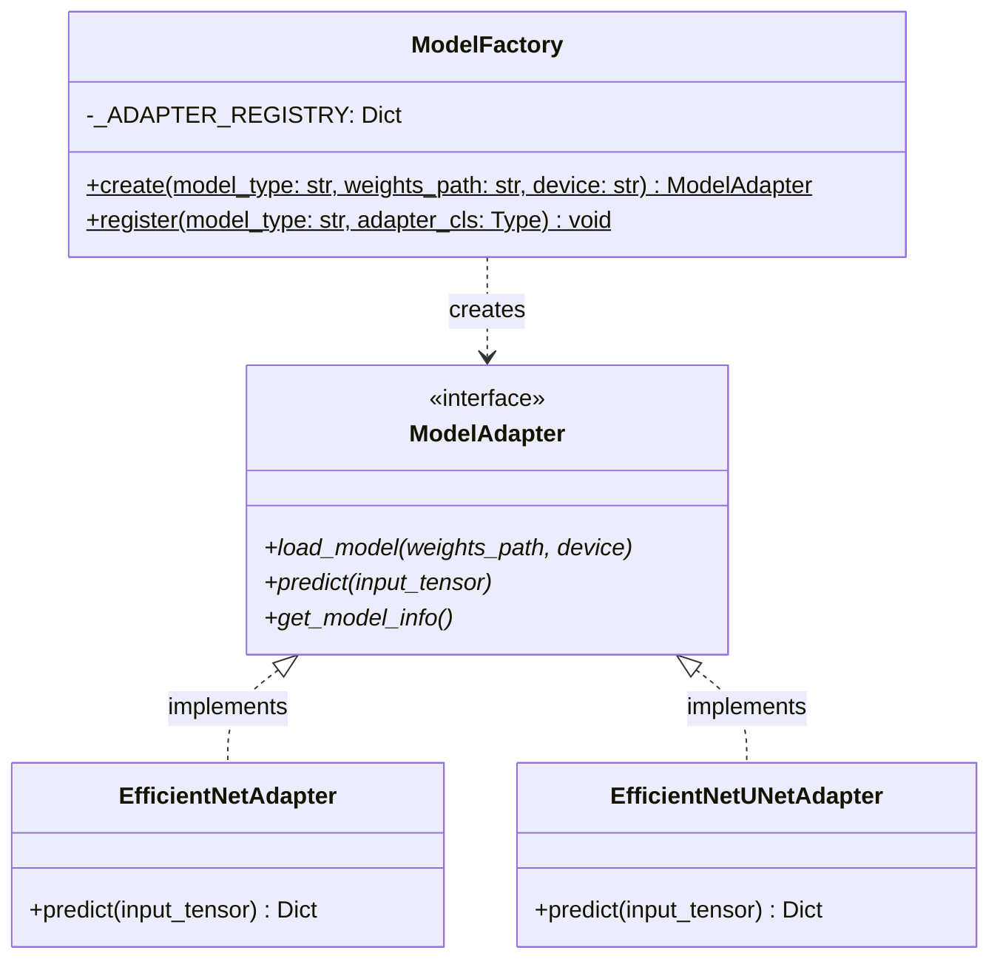
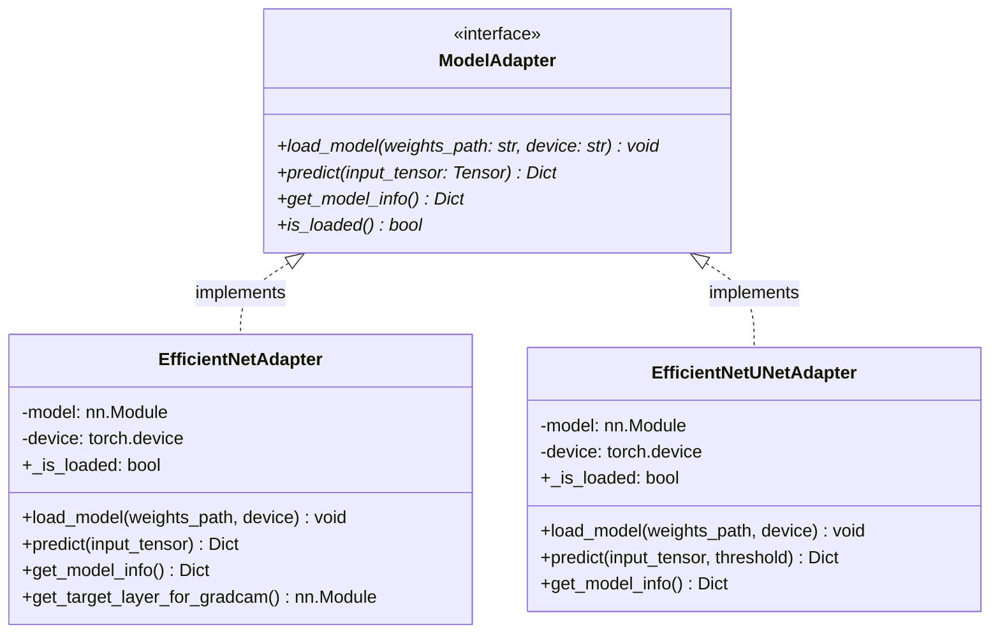
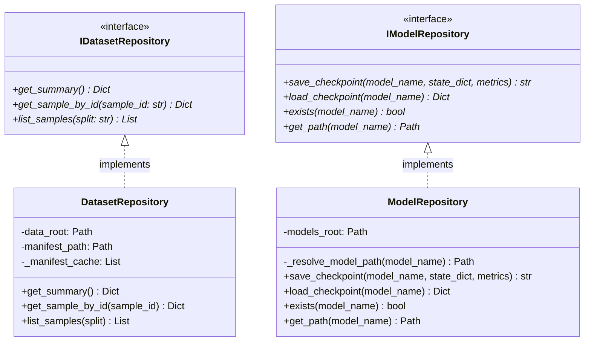
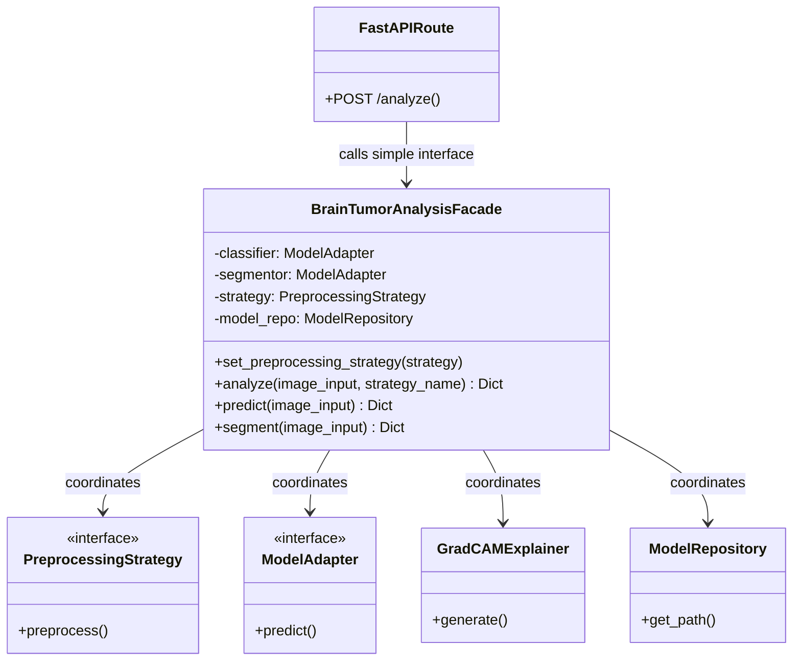

# BrainTumorAI: Design Patterns Documentation

**Course:** Design and Architectural Patterns  
**Semester:** 7th Semester B.Tech Computer Science and Engineering  
**Project:** BrainTumorAI  

This document details the **five core software design patterns** implemented and actively utilized throughout the BrainTumorAI system. Each pattern adheres to Gang of Four (GoF) architectural principles, addressing specific decoupling, extensibility, and maintainability requirements of medical imaging deep learning systems.

---

## Quick Reference Summary

| Pattern | Category | Project Implementation | Key Classes / Interfaces | Core Purpose |
| :--- | :--- | :--- | :--- | :--- |
| **Strategy** | Behavioral | Image Preprocessing Pipeline | `PreprocessingStrategy` `StandardPreprocessingStrategy` `FuzzyPreprocessingStrategy` | Dynamic runtime interchange of preprocessing logic (Standard vs Fuzzy Thresholding). |
| **Factory** | Creational | Model Instantiation Subsystem | `ModelFactory` | Encapsulates neural network construction and device binding without exposing constructor parameters. |
| **Adapter** | Structural | Model Uniformity Wrapper | `ModelAdapter` `EfficientNetAdapter` `EfficientNetUNetAdapter` | Provides uniform `predict()` and `get_model_info()` interface across distinct classification and segmentation models. |
| **Repository** | Architectural | Data & Artifact Persistence | `IDatasetRepository` `DatasetRepository` `IModelRepository` `ModelRepository` | Decouples business logic from filesystem `.mat`/`.png` operations and `.pth` checkpoint serialization. |
| **Facade** | Structural | Analysis Orchestrator | `BrainTumorAnalysisFacade` | Simplifies the complex 6-step diagnostic workflow into a single high-level `analyze(image)` call for API routes. |

---

## 1. Strategy Pattern

### Intent
Define a family of algorithms, encapsulate each one, and make them interchangeable. Strategy lets the algorithm vary independently from clients that use it.

### Problem It Solves
Different medical imaging literature recommends different image preprocessing techniques. For example, Sultan et al. (2019) utilize standard min-max scaling and channel replication, whereas Hassan & Boulila (2025) demonstrate that a 16-membership fuzzy thresholding and contrast accentuation algorithm improves tumor boundary salience. Without the Strategy pattern, changing or benchmarking these preprocessing algorithms would require modifying model inference code, introducing conditional spaghetti code (`if/else` checks everywhere), and violating the **Open/Closed Principle (OCP)**.

### Where It Appears in This Project
- Interface: `backend/app/domain/interfaces/preprocessing_strategy.py` (`PreprocessingStrategy`)
- Concrete Strategies:
  - `backend/app/domain/strategies/standard_preprocessing.py` (`StandardPreprocessingStrategy`)
  - `backend/app/domain/strategies/fuzzy_preprocessing.py` (`FuzzyPreprocessingStrategy`)
- Context: `BrainTumorAnalysisFacade.set_preprocessing_strategy(...)` and `facade.analyze(...)`.

### Main Classes
- `PreprocessingStrategy (ABC)`: Abstract base class defining `preprocess(image, target_size) -> np.ndarray`.
- `StandardPreprocessingStrategy`: Implements standard min-max normalization, bicubic resizing, and 3-channel grayscale replication.
- `FuzzyPreprocessingStrategy`: Implements 16-membership Center-of-Gravity (CoG) fuzzy threshold calculation and 5-zone (VL, L, M, H, VH) intensity contrast accentuation (Hassan & Boulila 2025).

### Why It Is Appropriate
Allows clinical researchers or the web dashboard user to toggle between Standard and Fuzzy preprocessing with a single click without changing or restarting the deep learning inference pipeline. New preprocessing techniques (e.g. CLAHE or Wavelet Denoising) can be added simply by creating a new class implementing `PreprocessingStrategy`.

### UML Diagram (Mermaid)

---

## 2. Factory Pattern

### Intent
Define an interface for creating an object, but let subclasses or factory methods decide which class to instantiate. Factory Method lets a class defer instantiation to subclasses or a centralized registry.

### Problem It Solves
Instantiating deep learning models in PyTorch involves complex parameterization: specifying backbone weights (`EfficientNet_B0_Weights.DEFAULT`), replacing classification heads, configuring encoder-decoder skip dimensions, setting device bindings (`cpu` vs `cuda`), and verifying checkpoint compatibility. Scattering `torchvision.models.efficientnet_b0(...)` or `EfficientNetUNet(...)` calls across scripts and API routes causes tight coupling and duplicate instantiation logic.

### Where It Appears in This Project
- Implementation: `backend/app/infrastructure/factories/model_factory.py` (`ModelFactory`)
- Used by: `BrainTumorAnalysisFacade`, `scripts/evaluate.py`, and test suites.

### Main Classes
- `ModelFactory`: Static/class factory providing:
  - `ModelFactory.create(model_type, weights_path=None, device="cpu", **kwargs) -> ModelAdapter`
  - Internal registry mapping `"efficientnet"` to `EfficientNetAdapter` and `"efficient_unet"` to `EfficientNetUNetAdapter`.
  - `ModelFactory.register(model_type, adapter_cls)` allowing dynamic registration of future models.

### Why It Is Appropriate
The application and presentation layers only need to request `"efficientnet"` or `"efficient_unet"`. The factory handles model creation, parameter passing, device allocation, and wrapping within the appropriate `ModelAdapter`.

### UML Diagram (Mermaid)

---

## 3. Adapter Pattern

### Intent
Convert the interface of a class into another interface clients expect. Adapter lets classes work together that couldn't otherwise because of incompatible interfaces.

### Problem It Solves
A classification model and a semantic segmentation model produce fundamentally incompatible outputs:
- **EfficientNet-B0 Classifier** outputs 1D class logits `(1, 3)`, requiring `softmax` activation, argmax indexing, class string mapping, and confidence score calculation.
- **EfficientNet-UNet Segmentor** outputs 2D spatial logits `(1, 1, 224, 224)`, requiring `sigmoid` thresholding, contour extraction, binary mask construction, and 2D pixel area computation.
Directly consuming raw PyTorch tensors in the application or API layer would tightly couple the system to framework internals and cause code fragmentation.

### Where It Appears in This Project
- Interface: `backend/app/domain/interfaces/model_adapter.py` (`ModelAdapter`)
- Adapters:
  - `backend/app/infrastructure/adapters/efficientnet_adapter.py` (`EfficientNetAdapter`)
  - `backend/app/infrastructure/adapters/efficientnet_unet_adapter.py` (`EfficientNetUNetAdapter`)

### Main Classes
- `ModelAdapter (ABC)`: Declares standard methods:
  - `load_model(weights_path: str, device: str) -> None`
  - `predict(input_tensor: torch.Tensor) -> Dict[str, Any]`
  - `get_model_info() -> Dict[str, Any]`
  - `is_loaded() -> bool`
- `EfficientNetAdapter`: Wraps `EfficientNet-B0`. Adapts forward logits into `{predicted_class, confidence, probabilities, logits}`.
- `EfficientNetUNetAdapter`: Wraps `EfficientNetUNet`. Adapts raw segmentation maps into `{mask, tumor_detected, tumor_area_pixels, tumor_area_percentage}`.

### Why It Is Appropriate
The application layer treats any deep learning model polymorphically via `adapter.predict(tensor)`. If we replace PyTorch with ONNX Runtime or TensorRT in the future, only the adapter changes; the application layer remains completely untouched.

### UML Diagram (Mermaid)

---

## 4. Repository Pattern

### Intent
Mediates between the domain and data mapping layers using a collection-like interface for accessing domain objects.

### Problem It Solves
Raw medical MRI datasets are stored in proprietary or scientific binary formats (e.g. MATLAB `.mat` structs containing `cjdata.label`, `cjdata.image`, `cjdata.tumorMask`), while preprocessed slices are stored as PNG files and JSON manifests across `train`, `val`, and `test` subdirectories. If scripts and endpoints directly execute `scipy.io.loadmat` or open files with hardcoded paths, changes to directory structure, storage formats, or database backends break the entire application.

### Where It Appears in This Project
- Interfaces: `backend/app/domain/interfaces/repositories.py` (`IDatasetRepository`, `IModelRepository`)
- Concrete Repositories:
  - `backend/app/infrastructure/repositories/dataset_repository.py` (`DatasetRepository`)
  - `backend/app/infrastructure/repositories/model_repository.py` (`ModelRepository`)

### Main Classes
- `IDatasetRepository (ABC)`: Declares methods `get_summary()`, `get_sample_by_id(sample_id)`, and `list_samples(split)`.
- `DatasetRepository`: Implements file scanning, caching the manifest JSON, loading images and ground-truth masks, and generating summary statistics.
- `IModelRepository (ABC)`: Declares methods `save_checkpoint()`, `load_checkpoint()`, `exists()`, and `get_path()`.
- `ModelRepository`: Standardizes path resolution (`models/classifier` vs `models/segmentation`), atomic checkpoint serialization, and sidecar metadata saving.

### Why It Is Appropriate
Completely shields the application from knowing where dataset files or trained `.pth` models live on disk. Allows swapping local filesystem storage for cloud storage (AWS S3 or Google Cloud Storage) without changing any analysis logic.

### UML Diagram (Mermaid)

---

## 5. Facade Pattern

### Intent
Provide a unified interface to a set of interfaces in a subsystem. Facade defines a higher-level interface that makes the subsystem easier to use.

### Problem It Solves
A comprehensive brain tumor MRI diagnosis involves multiple interdependent subsystems:
1. Decoding multi-format binary/image bytes
2. Applying preprocessing strategy (Standard or Fuzzy)
3. Converting NumPy arrays to normalized 4D PyTorch tensors
4. Invoking EfficientNet classification model adapter
5. Attaching backward hooks and calculating Grad-CAM gradients
6. Generating colorized Jet heatmaps and blending them over the MRI
7. Invoking EfficientNet-UNet segmentation model adapter
8. Computing estimated 2D tumor pixel area and percentage of brain parenchyma
9. Generating binary mask overlays with contour outlines
10. Formatting output into JSON and Base64 strings.
Exposing all these subsystems directly to the FastAPI route would create massive controller bloat, tightly couple HTTP networking to ML pipelines, and prevent code reuse.

### Where It Appears in This Project
- Implementation: `backend/app/application/brain_tumor_facade.py` (`BrainTumorAnalysisFacade`)
- Consumed by: `backend/app/api/routes/prediction.py` and `scripts/test_prediction.py`.

### Main Classes
- `BrainTumorAnalysisFacade`: High-level orchestrator class providing:
  - `analyze(image_input, strategy_name=None) -> Dict[str, Any]`
  - `predict(image_input) -> Dict[str, Any]`
  - `segment(image_input) -> Dict[str, Any]`
  - `set_preprocessing_strategy(strategy) -> None`

### Why It Is Appropriate
The FastAPI route becomes a clean 5-line controller function that simply calls `facade.analyze(...)`. Any client (CLI, REST API, or unit test) can run the complete diagnostic analysis with a single method call.

### UML Diagram (Mermaid)

---

## 6. Summary of Architectural Benefits

1. **Separation of Concerns:** Each layer has a well-defined single responsibility.
2. **Open for Extension, Closed for Modification (OCP):** New models can be added by implementing `ModelAdapter` and registering with `ModelFactory`. New preprocessing methods can be added by implementing `PreprocessingStrategy`.
3. **Testability:** Every pattern is covered with unit tests in `backend/tests/` using isolated mock inputs and fixtures.
4. **Resilience:** The Facade gracefully degrades if segmentation weights are absent, executing classification and Grad-CAM seamlessly while noting segmentation availability.
