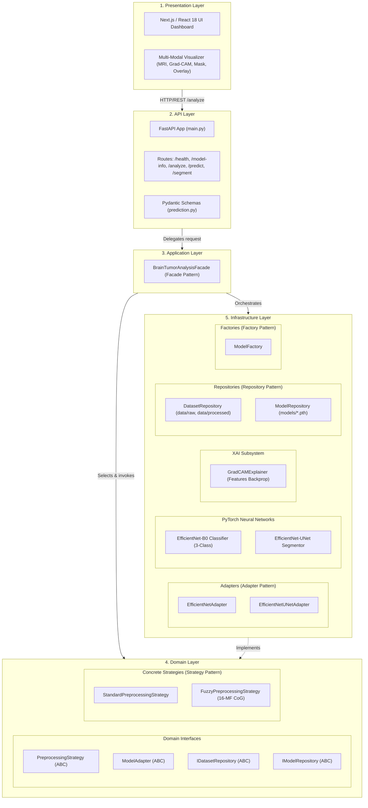
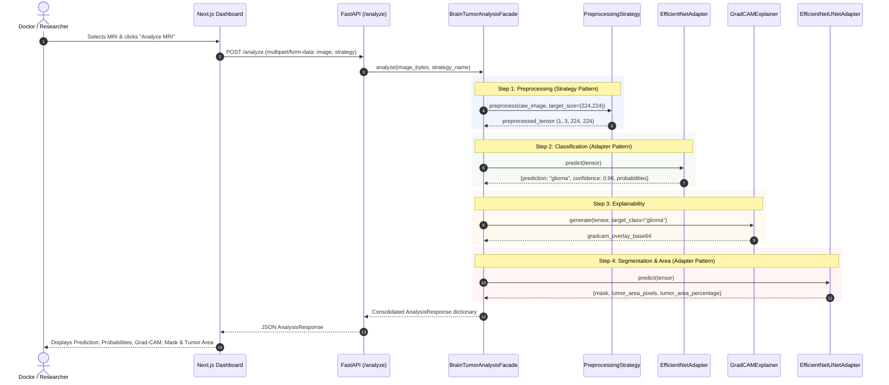

# BrainTumorAI: System Architecture Documentation

**Course:** Design and Architectural Patterns  
**Semester:** 7th Semester B.Tech Computer Science and Engineering  
**Project:** BrainTumorAI  
**Title:** Deep Learning Based Brain Tumor Segmentation and Classification from MRI Images  

---

## 1. Architectural Overview

BrainTumorAI is designed using a **5-Layer Architecture (Clean/Onion-inspired Layered Architecture)**. This architecture strictly separates concerns, ensures high cohesion and loose coupling, isolates infrastructure (frameworks, storage, deep learning libraries) from business and domain contracts, and facilitates testability.

---

## 2. Layer-by-Layer Breakdown

### Layer 1: Presentation Layer
- **Technology:** Next.js (React 18), TypeScript, Tailwind CSS, Lucide Icons.
- **Responsibilities:**
  - Medical image upload interface (drag-and-drop or single click).
  - Benchmark sample selection (allowing 1-click loading of verified test slices from test set).
  - Runtime Preprocessing Strategy selector (`Standard` vs `Fuzzy`).
  - Rendering real classification results (Predicted class, confidence %, probabilities breakdown).
  - Multi-modal diagnostic visualization (Original MRI, Grad-CAM attention heatmap, Predicted tumor mask, Tumor outline overlay).
  - Quantitative metrics display (2D estimated tumor area in pixels and percentage of brain tissue).
  - Prominent academic disclaimer.

### Layer 2: API Layer
- **Technology:** FastAPI, Uvicorn, Pydantic v2.
- **Responsibilities:**
  - Route declarations (`/health`, `/model-info`, `/analyze`, `/predict`, `/segment`).
  - Request validation and content-type checking.
  - Zero ML or business logic inside route functions: routes exclusively extract payloads and delegate to the Application Layer Facade.
  - CORS configuration enabling cross-origin requests from the web dashboard.

### Layer 3: Application Layer
- **Component:** `BrainTumorAnalysisFacade`.
- **Responsibilities:**
  - Orchestrates the sequential pipeline across domain and infrastructure components.
  - Coordinates image decoding, strategy selection, classifier forward pass, Grad-CAM gradient calculation, segmentation inference, tumor area measurement, and Base64 packaging.
  - Serves as the single point of entry for the API routes.

### Layer 4: Domain Layer
- **Interfaces:**
  - `PreprocessingStrategy`: Strategy interface specifying `preprocess(image, target_size)`.
  - `ModelAdapter`: Target interface defining `load_model()`, `predict()`, `get_model_info()`, `is_loaded()`.
  - `IDatasetRepository`: Contract for retrieving samples, partitions, and dataset metadata.
  - `IModelRepository`: Contract for saving/loading model weights and metrics.
- **Strategies:**
  - `StandardPreprocessingStrategy`: Min-Max normalization, bicubic interpolation, 3-channel replication.
  - `FuzzyPreprocessingStrategy`: Center-of-Gravity (CoG) adaptive threshold calculation using 16 triangular membership functions and 5 illumination zones (VL, L, M, H, VH) inspired by Hassan & Boulila (2025).

### Layer 5: Infrastructure Layer
- **Models:**
  - `EfficientNet-B0`: Modified transfer learning classification network for 3 tumor classes (`0 = glioma`, `1 = meningioma`, `2 = pituitary`).
  - `EfficientNetUNet`: Encoder-decoder architecture combining EfficientNet-B0 feature extractor with U-Net upsampling and skip connections.
- **Adapters:**
  - `EfficientNetAdapter`: Adapts raw PyTorch classifier outputs to standardized prediction dictionaries.
  - `EfficientNetUNetAdapter`: Adapts segmentation outputs, performs binarization, calculates 2D pixel area and percentage of brain parenchyma.
- **Factory:**
  - `ModelFactory`: Factory pattern implementation creating model adapters on demand.
- **Explainability:**
  - `GradCAMExplainer`: Computes gradients of the target class score with respect to the final convolutional feature maps, produces Jet colormap heatmap, and alpha-blends over MRI slice.
- **Repositories:**
  - `DatasetRepository`: Manages dataset access from disk.
  - `ModelRepository`: Manages checkpoint persistence and retrieval.

---

## 3. End-to-End Data Flow

